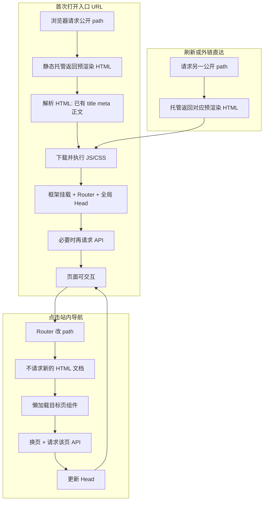

# SPA 静态托管场景下的 SEO 实践（通用方法）

面向：Vue / React 等 CSR SPA，部署在纯静态托管（无 Node SSR）时，如何让搜索引擎与社交预览拿到可用的首包 HTML。

阅读顺序：**为什么做 → 做什么 → 构建期怎么做 → 运行时发生什么 → 基础设施与概念 → 怎么落地与验收**。

---

## 1. 问题与约束

| 约束 | 含义 |
|------|------|
| 技术栈 | 前端 SPA（CSR） |
| 部署 | 纯静态文件托管，没有服务端渲染环境 |
| 目标 | 搜索引擎与社交抓取能读到正确的 title / description / 正文 |

传统 SPA：首包往往是空壳 `#app`，title、描述、正文要等 JS 跑完才有。静态托管又上不了完整 SSR，需要另一条路。

---

## 2. 方案结论

**全站补齐 SEO 基础设施（meta / canonical / hreflang / robots / sitemap / JSON-LD），对无需登录的公开页做构建期预渲染，在不改部署形态的前提下，让公开页首包 HTML 自带可索引内容。**

不是整站 SSR，也不是「只改几个 meta」。

页面策略优先级：

**固定公开页预渲染 > 数量很多的动态详情页（如 `/articles/:id`）运行时 Head > 登录页应用 noindex 禁止被搜索引擎收录**

---

## 3. 为什么不全站 SSR / SSG？

| 方案 | 是否采纳 | 原因 |
|------|----------|------|
| 迁框架上 SSR | 通常否 | 部署与架构成本高，静态托管不匹配 |
| 预渲染全部路由（含登录态、以及数量很多的动态详情页） | 暂不做 | 登录页应用 noindex 禁止被搜索引擎收录；类似 `/articles/:id` 这类 path 数量过多 |
| **全站 Head 管理 + 公开页预渲染** | 推荐 | 成本可控，覆盖收录与分享预览 |

---

## 4. 整体架构

```text
用户 / 爬虫请求公开 URL
        │
        ▼
 静态托管产物
        │
        ├─ 各公开路由的预渲染 HTML（建议 path.html）
        ├─ SPA shell（如 404.html）← 未预渲染深链回退
        ├─ robots.txt
        └─ sitemap.xml

运行时（浏览器 / 能执行 JS 的爬虫）：
  全局 Head 管理 → 按路由切换 title / OG / canonical / hreflang
  动态详情页（如 `/articles/:id`）可按接口数据覆盖 Head
```

构建顺序：

```text
前端打包（vite / webpack …）
  → 复制 SPA shell 为深链回退文件（如 404.html）
  → Headless 浏览器打开公开路由，把渲染结果写入对应 HTML
```

> 产物用 `path.html` 而不是 `path/index.html`，可避免部分静态托管对尾斜杠做 301。

---

## 5. 构建期：公开页预渲染

这是相对「只改 meta」的核心差异：让公开 URL 的**首包源码**里就有标题、描述和可见正文。

### 5.1 流程

1. 在构建产物目录起本地静态服务（未匹配路径回退到 SPA shell）
2. Headless 浏览器访问各公开路由（含各语言副本）
3. 等待页面「壳就绪」标记，并确认关键标题 / `document.title`
4. 若有首屏动态列表，再等「内容就绪」（成功 / 空 / 失败都置位，避免死等）
5. 短等 Head 刷入后，导出完整 HTML

就绪信号建议分两层：

| 信号 | 含义 |
|------|------|
| 壳就绪 | 静态主文案区已挂载 |
| 内容就绪 | 首段接口列表加载结束（含空结果与失败） |

### 5.2 动态内容进不进 HTML？

| 内容类型 | 是否进静态 HTML | 作用 |
|----------|-----------------|------|
| Title / Description / H1 / 固定文案 | 稳定固化 | 收录与分享预览的主信号 |
| 列表等接口数据 | 接口可达时写入 | 丰富正文；失败时可能为空 |
| 数量很多的动态详情页（如 `/articles/:id`） | 通常不预渲染 | 运行时 Head；热门 path 可后续批量预渲染 |

### 5.3 预渲染如何绕过接口跨域

页面跑在本机静态服务（`http://127.0.0.1:端口`），请求远程 API 时会触发浏览器 CORS。预渲染**不依赖改后端 CORS**，而是用 Headless 的请求拦截在 Node 侧转发：

```text
页面 JS 发起 API 请求
        │
        ▼
 page.route 拦截（匹配 API 路径或域名）
        │
        ▼
 route.fetch()：Node 发真实 HTTP（不受浏览器 CORS 限制）
        │
        ▼
 route.fulfill({ response })：把响应塞回页面
```

要点：

- 实际出网由 Node 完成，绕过浏览器跨域校验
- 构建时 API 基址应指向**可访问的绝对地址**（或能被拦截规则匹配的路径）；若仍是相对 `/api` 且本机没有后端，会得到空列表——这是「没数据」，不是 CORS
- 代理失败时打日志并中止该请求，页面仍可置位「内容就绪」，避免构建卡死

### 5.4 缺数据告警（可选）

动态列表为 0 条或等待超时时，可汇总后通过 IM / Webhook 告警；**默认不阻断构建**，避免偶发 API 抖动挡部署。未配置告警通道时仅打日志。

---

## 6. 运行时：首屏与站内导航

预渲染解决的是：**第一次打开某个 URL** 时，源码里就要有可索引内容。用户进站后点导航，仍是经典 SPA 客户端路由，**不会**再向服务器请求下一页的预渲染 HTML。

### 6.1 打开入口页（整页加载）

1. 浏览器向静态托管请求该 URL
2. 托管返回对应预渲染 HTML（如 `/` → `index.html`，`/about` → `about.html`），已含 title、meta、正文骨架与资源链接
3. 浏览器解析 HTML，下载并执行应用脚本
4. 框架挂载（CSR 接管）：Router、全局 Head 生效；动态块可能再请求 API 刷新
5. 页面可交互

不执行 JS 的爬虫 / 社交抓取：第 2 步的预渲染 HTML 即足够。人机用户：第 3–4 步后与普通 SPA 一致。

### 6.2 点击站内导航（客户端跳转）

1. 应用内链接（`RouterLink` / `router.push`），不是整页硬刷新
2. History API 改地址栏，**不发起**对新 HTML 文档的请求
3. Router 懒加载目标页组件
4. 换页；目标页自行请求 API
5. 全局 Head 随路由更新 title / OG / canonical / hreflang；若有页级 JSON-LD 一并写入

磁盘上的 `about.html` 等**不会被这次点击用到**——只服务于「直接打开 / 刷新该 URL」。

### 6.3 流程图



### 6.4 三种打开方式对照

| 方式 | 是否下载对应预渲染 HTML | Head / 正文从哪来 |
|------|-------------------------|-------------------|
| 外链 / 书签 / 刷新直达公开页 | 是 | 首包来自预渲染；JS 起来后再校正 |
| 站内导航从 A 到 B | 否 | 全程 CSR：组件 + 路由级 Head |
| 直达未预渲染深链 | 常落到 SPA shell 回退 | 壳 HTML → JS 渲染；动态详情靠运行时 Head |

**要点：** 预渲染 HTML 服务「每个可索引 URL 的首包」；站内点来点去是同一份已加载 SPA 在切换视图。两者互补。

---

## 7. SEO 基础设施与关键概念

### 7.1 能力一览

下面每一项都是「让爬虫 / 社交平台看懂页面」的基础设施。做法一句话，后面跟含义与例子。

#### 动态 Head

**做什么：** 用统一的 Head 管理（如 `@unhead` / `react-helmet`），按**当前路由**写入 `<title>`、description、OG 等，用户点站内导航换页时也会跟着改。

**为什么需要：** SPA 不会整页刷新，如果不按路由更新 Head，分享卡片和浏览器标签会一直停在上一页的标题。

**例子：** 打开 `/pricing` 时写入：

```html
<title>Pricing — Example</title>
<meta name="description" content="Simple pay-as-you-go pricing for every plan." />
<meta property="og:title" content="Pricing — Example" />
```

从首页点进价格页后，标签栏和再分享时的预览会变成上面这套，而不是还显示首页标题。

#### Canonical

**做什么：** 声明「这一页的正版 URL」，形式是当前 path 的绝对地址（一般不含追踪参数）。

**为什么需要：** 人觉得是同一页，爬虫按 URL 记账。同一内容常有多个地址：

| 变体 | 示例 |
|------|------|
| 查询参数 | `/pricing` vs `/pricing?utm_source=x` |
| 尾斜杠 | `/pricing` vs `/pricing/` |
| www / 协议 | `www.example.com` vs `example.com` |

没有 canonical 时可能：分别收录、外链权重被稀释、或引擎只挑一个展示且不一定是你想要的那个。

**例子：**

```html
<link rel="canonical" href="https://example.com/pricing" />
```

即使用户是从 `https://example.com/pricing?utm_source=newsletter` 进来的，正版仍记为 `/pricing`。**不同语言页应各自有 canonical**，再用 `hreflang` 互指，不要都指到同一 URL。

#### 多语言（hreflang）

**做什么：** 用 `hreflang` 告诉搜索引擎「这些是同一页的不同语言版本」，并标一个 `x-default` 作默认回落；链接要和站点的语言前缀路由一致。

**为什么需要：** 避免英文页和中文页被当成重复内容，或在错误的地区搜出错误语言。

**例子：** `/pricing` 与 `/zh-CN/pricing` 互相声明：

```html
<link rel="alternate" hreflang="en" href="https://example.com/pricing" />
<link rel="alternate" hreflang="zh-CN" href="https://example.com/zh-CN/pricing" />
<link rel="alternate" hreflang="x-default" href="https://example.com/pricing" />
```

在中国搜到的更可能是中文版，在英文环境更可能是英文版。

#### 结构化数据（JSON-LD）

**做什么：** 在 HTML 里塞一段 JSON（JSON for Linked Data），用 [schema.org](https://schema.org) 词汇描述「这是公司 / 网站 / 网页」。首页常见 `Organization` + `WebSite`；子公开页可挂 `WebPage`（`isPartOf` 挂回站点）。

**为什么需要：** 帮搜索引擎理解页面语义（不只是字符串），有时有利于展示更清晰的结果；**不保证**一定出富媒体卡片。

和 Canonical 的分工：Canonical 解决「哪个 URL 是正本」；JSON-LD 解决「内容语义上是什么」。

**例子：**

```html
<script type="application/ld+json">
{
  "@context": "https://schema.org",
  "@type": "Organization",
  "name": "示例公司",
  "url": "https://example.com"
}
</script>
```

#### 爬虫指引（robots.txt）

**做什么：** 站点根路径放一份 `robots.txt`，约定爬虫可以抓哪些路径、不要进哪些路径，并常附上 sitemap 地址。

**为什么需要：** 减少爬虫浪费配额去爬登录、账号后台等无收录价值的页面。

**例子：** `https://example.com/robots.txt`

```text
User-agent: *
Allow: /
Disallow: /auth
Disallow: /billing
Sitemap: https://example.com/sitemap.xml
```

含义：公开页可抓；`/auth`、`/billing` 不要抓。

#### 站点地图（sitemap.xml）

**做什么：** 列出希望被收录的公开 URL，多语言站通常为每个语言版本各写一条，并用 alternate 互指。

**为什么需要：** 给搜索引擎一份「请优先关注这些页」的清单，加快发现新页、补齐漏抓。

**例子：** `https://example.com/sitemap.xml` 中的一条：

```xml
<url>
  <loc>https://example.com/pricing</loc>
  <xhtml:link rel="alternate" hreflang="en" href="https://example.com/pricing" />
  <xhtml:link rel="alternate" hreflang="zh-CN" href="https://example.com/zh-CN/pricing" />
  <xhtml:link rel="alternate" hreflang="x-default" href="https://example.com/pricing" />
</url>
```

#### 隐私策略（页面级 noindex）

**做什么：** 对需登录的路由，在页面 `<head>` 里写 `noindex, nofollow`，明确要求「不要收录、不要顺着页内链接继续抓」。

**为什么需要：** 仅靠 `robots.txt` 不够（它是建议，且用户仍可能分享出带登录态的 URL）。页面级 meta 是更直接的「禁止收录」信号。

**例子：** 打开 `/billing` 时：

```html
<meta name="robots" content="noindex, nofollow" />
```

即使有人把账单页链接发到外网，搜索结果里也不应出现该页。

### 7.2 索引策略模板

| 页面类型 | 预渲染 | 索引 |
|----------|--------|------|
| 固定公开页（各语言） | ✅ | ✅ |
| 数量很多的动态详情页（如 `/articles/:id`） | ❌ 或仅热门批量 | ✅（运行时 Head） |
| 登录 / 账号后台 | ❌ | ❌（robots + noindex） |

---

## 8. 工程落地

### 8.1 推荐目录（可套用）

| 模块 | 职责 |
|------|------|
| `seo/config` | 站点 origin、默认 OG、路由 → SEO 文案 |
| 路由级 Head composable | 按路由写 meta / canonical / hreflang；首页 JSON-LD |
| 根组件挂载 | 全局启用路由 SEO |
| `index.html` | 无 JS 时的 fallback meta |
| `public/robots.txt` | 爬虫规则 |
| `public/sitemap.xml` | 站点地图（可改为构建生成） |
| `scripts/prerender` | 构建期预渲染 |
| CI | 安装 Chromium 后跑完整 build |

### 8.2 静态托管注意点

1. CI 必须能跑 Headless 浏览器  
2. 先准备 SPA shell 回退文件，再预渲染覆盖各公开 HTML  
3. 未预渲染深链依赖 shell 回退进 Router  
4. 多语言公开页各自独立预渲染文件  
5. 站点 origin 按环境区分；OG 图用绝对 URL 的 JPEG/PNG（约 1200×630），SVG 常被社交平台忽略  

### 8.3 验收清单

1. 打开构建产物 HTML **源码**（不要只看渲染后 DOM）  
2. 确认含 title、description、OG、canonical、可见正文（非空壳）  
3. 用 `curl` 或「查看网页源代码」对线上 URL 再验一次  
4. 抽查 `/robots.txt`、`/sitemap.xml`  
5. 回归：深链、语言切换、登录后页不被误索引  
6. 可选：各平台调试工具验 OG 卡片  

---

## 9. 边界与可选增强

**边界**

- 预渲染覆盖固定公开路由，不含全部动态详情页（如 `/articles/:id`）
- 动态接口块不保证进入静态 HTML；可告警、默认可不阻断部署
- 动态详情页主要靠运行时 Head

**可选增强**

1. 热门动态 path 批量预渲染  
2. 构建时注入数据快照，减少对线上 API 的依赖  
3. sitemap 由构建脚本按公开路由自动生成  
4. Search Console 提交 sitemap，监控覆盖率  

---

## 10. 一句话版

> 在**不改静态托管**的前提下：  
> 1）全站统一管理 title / description / OG / canonical / 多语言 hreflang，并配 robots + sitemap；  
> 2）构建时用 Headless 浏览器把**公开页**预渲染成带正文的 HTML。  
>
> 搜索与社交打开源码即可看到主文案；动态列表尽量在构建时写入；数量很多的动态详情页（如 `/articles/:id`）用运行时 Head，后续可对热门 path 再批量预渲染。站内导航仍是 SPA，不重复下载预渲染 HTML。
